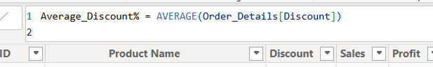
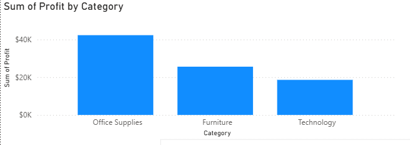

# 📊 Retail Sales Performance Dashboard (Power BI)

[View The Dashboard](https://app.powerbi.com/view?r=eyJrIjoiYTE2OTY0ODQtNjU3NC00MjkzLThhYTQtZWE4YzMzZWE2ZDdlIiwidCI6IjNlYTdjMTI4LWM2MDEtNDQ3OS1hMDAzLWUxNGQwMGMwYjVjYiJ9 )

## 🔹 Project Overview

This project uses **Power BI** to analyse retail sales data and create an interactive dashboard to explore sales performance.

The aim of this project was to prepare the data, build relationships between tables, create measures, and use visualisations to identify patterns in sales across different regions, categories, and customer segments.

---

## 🔹 Dataset

**Retail Sales Dataset**

- **Source:** Provided via bootcamp
- **Tables:**
  - Order_Details
  - Order_Information

The dataset contains **2,117 rows** of retail transaction data, including information about sales, products, customers, locations, and customer segments.

The data was stored across two tables, which were connected using **Order ID** as the common field.

---

## 🔹 Data Preparation

The following steps were completed during the project:

| Process | Description |
|---------|-------------|
| Data Importing | Imported the retail dataset into Power BI |
| Data Cleaning | Used Power Query to clean and prepare the data |
| Data Validation | Checked data types and corrected formatting issues |
| Connecting Datasets| Create a relationship between Order_Details and Order_Information using Order ID |
| Data Preparation | Ensured the data was ready for analysis and visualisation |

---

## 🔹 Data Formatting and Transformation

- **Power Query** 

  

Here I used Power Query to check for missing data, errors, changed Data Types and removed unused columns. 

- **Connecting Datasets** 

  

Here the relationship between the two tables is created to combine the information in both tables. 

- **DAX Measures**
  

  

Here I used DAX to create the Average Discount Rate calculation and Profit Margin Percentage. 

- **Data Formatting**

  

Here I formatted the sales and discounts column to currency for better readability.

---

## 🔹 Analysis

The dashboard was created to explore:

- Overall sales and profit results
- How sales are distributed across customer segments
- How different regions contribute to total sales
- The factors that influence overall sales performance

  
   
  <em>Retail Sales Dashboard created in Power BI.</em>

The dashboard allows users to interact with different visuals, by selecting a category, region, or segment the charts show relevant sales information. This helps users explore the data in more detail.

---

## 🔹 Key Findings

### 1. Sales Factors Analysis

The **Decomposition Tree** was used to break down total sales by region, customer segment, and country to understand which factors contributed most to sales.

  
   
  <em>Analysing sales performance using the Decomposition Tree.</em>

The analysis showed that:

- The **Central region generated the highest sales**, with approximately **$362K**.
- The **Consumer segment generated the highest sales**, contributing approximately **$349K (53.65%)** of total sales.
- The visual allowed further drill-down into countries to understand where sales were coming from.

**Business relevance:**

This analysis helps identify which regions and customer groups contribute the most to sales and where further investigation maybe needed.

---

### 2. Profit Performance by Category

I analysed profit across different product categories to compare which categories produced the highest profit.

  
   
  <em> Bar Chart</em>

The analysis showed:

- Office Supplies had the highest profit.
- Furniture had made **$25K** in profit.
- Technology had the lowest profit.

**Business relevance:**
This analysis helps businesses understand which products contribute most to profitability.

---

## ✅ Conclusion

This project demonstrates my ability to use **Power BI** to clean data, create relationships between tables, create DAX calculations, and build an interactive dashboard.

Through this project, I developed experience with **Power Query, data modelling, DAX, and data visualisation**, while using retail data to identify sales patterns and communicate insights.
