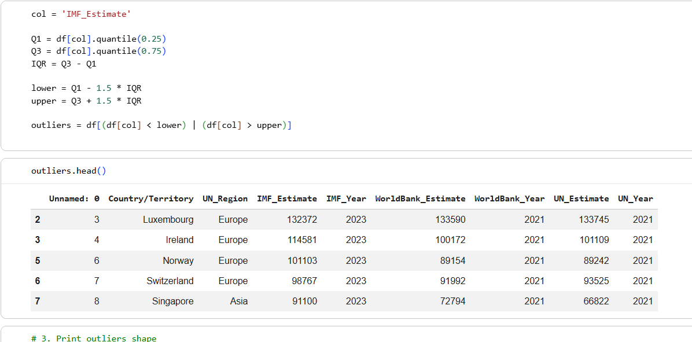

# GDP Nominal Per Capita (Python)

## Project Overview - [Click-here-to-see-Colab-page](https://colab.research.google.com/drive/15DomvHb9vWH_qhxbvpMkcTWZboUc6PMq#scrollTo=o00VsTI2dAoe)

This project uses **Python** to clean, analyse, and visualise GDP Per Capita across different countries. 

## Dataset 

***GDP Nominal Per Capita** 

*Sources*: via bootcamp 

## Data Preparation

* Uploading and exploring the dataset using **Pandas**.
* Checking data types and identifying data quality issues.
* Checking and correcting missing values, incorrect dates, and formatting problems.
* Correcting invalid date values and converting them into missing values (`NaT`).
* Removing extra spaces from text fields to improve consistency.
* Preparing string fields for accurate filtering and analysis.
* Using charts and summary numbers to find key trends in the data.
* Finding outliers using the **Interquartile Range (IQR)** method.

## Analysis

* Importing Pandas to use for data cleaning and manipulation.  
* Importing NumPy to use for numerical analysis and regression.  
* Importing Matplotlib and Seaborn to use for data visualisation.  
* Correlation analysis.  
* Outlier detection using IQR.  
* Linear regression.  

 

## Key Findings 

 1. **Comparing Economic Estimates Across Organisations**

The heatmap shows a nearly perfect match (0.93) between the United Nations and World Bank numbers, proving that both organizations report almost identical wealth patterns for these countries.

  
  
 <em> Heatmap </em>

**Business relevance:**

By comparing data from different global organizations, a business can make sure the information is consistent and trustworthy before using it to make big investment decisions.

 2. **Identifying Economic Outliers**

Using the Interquartile Range (IQR) method, I identified 23 countries with unusually high GDP per capita values, including Luxembourg, Ireland, and Singapore.

  
   
  <em> Interquartile Range and outliers</em>

**Business relevance:**

Identifying outliers helps analysts understand unusual patterns in the data and investigate factors that may influence overall results.

## Conclusion

This project demonstrates my ability to use Python to clean, analyse, and visualise real-world economic data. Using **Pandas, NumPy, Matplotlib, and Seaborn**, I applied data cleaning, exploratory analysis, statistical techniques, and visualisation methods to turn raw data into useful insights.
