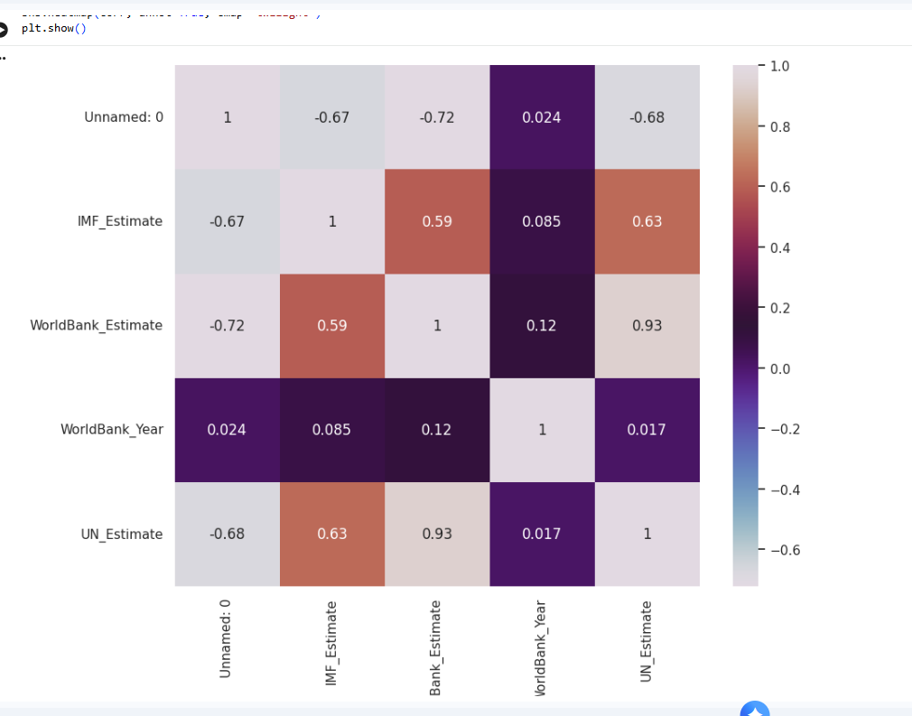

# 🐍 GDP Nominal Per Capita (Python)

[Open In Colab](https://colab.research.google.com/drive/15DomvHb9vWH_qhxbvpMkcTWZboUc6PMq#scrollTo=o00VsTI2dAoe)
---

## 🔹 Project Overview -

This project uses **Python** to clean, analyse, and visualise GDP Per Capita across different countries. 

---

## 🔹 Dataset 

### GDP Nominal Per Capita
- **Rows:** 223
- **Columns:** 9
- **Format:** CSV
**Sources**: via bootcamp 

---

# 🔹 Data Preparation

The following data preparation steps were completed:

| Process | Description |
|----------|-------------|
| Data Import | Loaded and explored the dataset using **Pandas**. |
| Data Inspection | checked data types and identified data quality issues. |
| Missing Data | Checked for and handled missing values. |
| Date Cleaning | Corrected invalid dates and converted them to `NaT`. |
| Text Cleaning | Removed extra spaces and prepared string fields for analysis. |
| Data Preparation | Prepared the dataset for analysis and filtering. |
| Data Analysis | Used charts and calculations to analyse the data. |
| Identifying Outlier  | Found outliers using the **Interquartile Range (IQR)** method. |

---

## 🔹 Analysis

The analysis involved:

- Using Pandas to clean and manipulate the data.
- Using NumPy for numerical calculations.
- Creating visualisations with Matplotlib and Seaborn.
- Analysing relationships between variables.
- Identifying outliers using the IQR method.
- Applying linear regression.

  
   
  <em>Importing libaries in Python </em>

Here Pandas, Numpy, Matplotlib and Seaborn were imported into python to use for analysis and visulisation

  
   
  <em> Checking data types </em>

This code displays the data type of each column within the dataframe. This is to ensure all the fields are correctly formatted for analysis. 

  
   
  <em> Formatting DateTime </em>

This code converts the IMF year data into a datetime structure, while missing entries are recorded as NaT values.

  
   
  <em> scatter plot </em>

This scatter plot shows a positive linear relationship between the UN Estimates and World Bank Estimates.

---

## 🔹 Key Findings 

### 1.Comparing Economic Estimates Across Organisations

I created this heatmap, 

  
  
 <em> Heatmap </em>

The analysis showed that:

The heatmap shows a **0.93** between the **United Nations (UN)** and **World Bank** numbers, suggesting that both organizations report similar trends across the countries analysed.

**Business relevance:**

By comparing data from different global organizations, a business can make sure the information is consistent and trustworthy before using it to make decisions.

---

## 2.Identifying Outliers

I used the Interquartile Range (IQR) to identify outliers.

  
   
  <em> Interquartile Range and outliers</em>

The analysis showed that:
- Using the Interquartile Range (IQR) method, **23** countries were identified with unusually high GDP per capita values.
- The top 5 included **Luxembourg**, **Ireland** and **Singapore**. 

**Business relevance:**

Identifying outliers helps analysts understand unusual patterns in the data and investigate factors that may influence overall results.

---

## ✅ Conclusion

This project demonstrates my ability to use Python to clean, analyse, and visualise economic data. Using **Pandas, NumPy, Matplotlib, and Seaborn**, I applied data cleaning, Data exploration, Analytical methods, and visualisation methods to turn raw data into insights.
