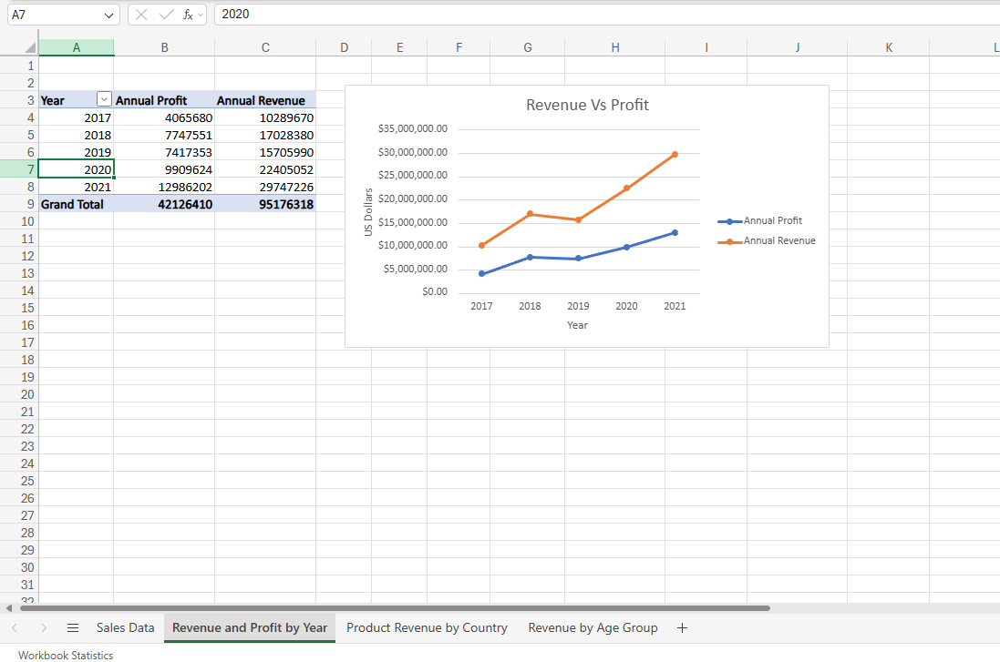
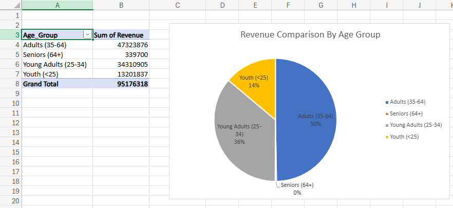
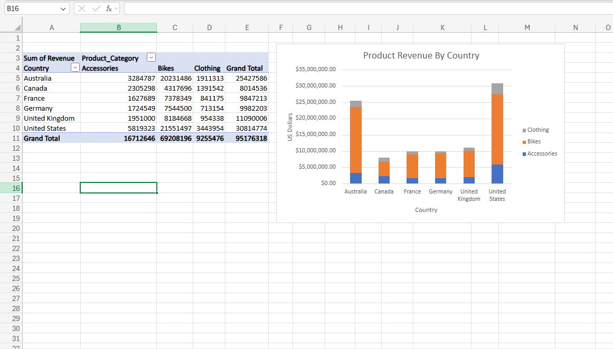

# RadwaMo-Data-Analysis-Portfolio

Hi my name is Radwa,
this is a data analysis portfolio of projects, that I built during my level 3 data analysis bootcamp. It demonstrates skills in data cleaning, analysis and 
visulisation using Excel, SQL, PowerBi, Tableau and Python. 

 

## My Skills

**Excel and data basics** – I used Excel for data cleaning, validation and formatting. Applied formulas such as XLOOKUP, IF statements and conditional formatting for analysis. Created pivot tables, pivot charts and dashboards for data visualisation. 
 

**Power BI and Tableau / Dashboards** – I used Power Query, DAX and calculated fields to clean data and perform calculations. I also built interactive dashboards that identify patterns and show insights. 
 

**SQL / MySQL Workbench** – I used WHERE, AND and OR to filter data, and applied aggregation functions such as GROUP BY and HAVING to analyse the data while joining tables. 
 

**Python / Google Colab** – I learned how to use Python libraries such as pandas, NumPy, matplotlib and seaborn to perform data cleaning, aggregations and data visualisation.

 

# Projects I have completed.

 

# Bikes and Retail Sales Analysis (Excel)

## Project Overview

Throughout these two projects, I used **Microsoft Excel** to clean, analyse, and visualise retail and bike sales data. The aim was to transform sales data into insights by analysing customer behaviour, product performance, and revenue trends.
 

## Approach & Process 

* Removing duplicates.  
* Standardising dates and currency formats.  
* Cleaning and organising the datasets.  
* Applying Excel formulas to calculate business metrics.  
* Creating PivotTables to summarise sales performance.  
* Building PivotCharts to visualise trends.  
* Using conditional formatting to highlight key patterns and performance.  
 

## Methods & Tools Used

* Data cleaning and formatting.  
* SUMIFS and AVERAGEIF functions.  
* Calculated columns for revenue, cost, and profit.  
* PivotTables to summarise data.  
* PivotCharts to visualise and analyse trends.  
* Conditional formatting to highlight performance.  
 

  

                                                                Retail Product Sales Analysis  

  

                                                                
                                                               Revenue & Profit Over Five Years  

  

                                                               
                                                               Revenue by Customer Age Group  

  

                                                              Product Revenue by Country  

 

## Datasets 

**Retail Sales Dataset**  
**Bike Sales Dataset**  

*Source*: Provided via bootcamp 

The retail dataset contains 1,001 rows of customer, product, and sales information. 

The bike sales dataset contains 113,037 transactions, including customer demographics, product information, sales, costs, and revenue. 
 

## Key Findings 

1. **Customer Purchasing Behaviour**

The retail analysis showed that clothing was the most frequently purchased product category by both male and female customers. However, despite having the highest purchase volume, clothing generated the lowest total sales, indicating a lower average selling price compared with other product categories. 

*Business relevance:* 

Understanding purchasing behaviour helps organisations evaluate pricing strategies, product performance, and opportunities to improve profitability. 

2. **Revenue Trends and Market Performance** 

The bike sales analysis revealed strong revenue growth over five years, reaching a peak of $29.7 million in 2021. The United States generated the highest overall revenue, while adult customers accounted for half of all purchases, making them the largest customer group. 

*Business relevance:*

These insights can help organisations identify high-performing markets, understand their core customer base, and make informed decisions about future sales and marketing strategies. 

## Conclusion 

This project demonstrates my ability to clean and analyse data using Excel, apply formulas and PivotTables, and create visualisations and identify insights. 

 

 

# Spotify Features (Tableau) 

## Project Overview 

This project uses **Tableau** to analyse Spotify track data and analyse trends in music popularity. 

The interactive dashboard allows users and stakeholders to explore the relationships between audio features and popularity, providing insights into factors that contribute to a tracks success. 

 
## Approach & Process

* Importing and exploring the Spotify dataset.  
* Applying aggregation functions such as SUM() and AVG().  
* Creating multiple worksheets to analyse different listener trends.  
* Adding linear regression trend lines to identify correlations between variables.  
* Building an interactive dashboard using filters and multiple visualisations.  
* Analysing the completed dashboard to identify key insights.  

## Methods & Tools Used  

* Data aggregation using average and sum calculations.  
* Scatter plots with linear regression trend lines.  
* Bar charts compare genres and artists.  
* Interactive filters to explore different areas of the dataset.  
* Interactive dashboard design using multiple worksheets. 

Dashboard Visualisations 

(put screenshots here) 

Genre Popularity  

Track Characteristics by Genre  

Average Popularity vs Average Danceability  

Popularity by Artist  

Popularity Based on Track Duration  

 

## Dataset 

 ***Spotify Features Dataset**  

*Source*: Provided via bootcamp  

The dataset contains 232,726 rows and 18 columns, it includes information on artists, genres, popularity, and Spotify audio features such as danceability, energy, duration, tempo, acousticness, and valence. 

## Key Findings 

1. **Track Characteristics and Popularity** 

The analysis found a positive relationship between danceability and popularity, with tracks scoring between 0.5 and 0.7 in danceability having higher popularity. It also showed that tracks lasting between 3.5 – 4.5 minutes performed better than shorter or longer songs. 

**Business relevance:** 
These insights could help Spotify improve playlist recommendations and support artists and record labels in understanding listener preferences. 

 

2. **Genre and Artist Performance** 

The dashboard showed that Pop, Rap, and Rock were the most popular genres in the dataset. Drake achieved the highest overall popularity, while artists such as Hans Zimmer showed that other genres can also generate significant listener engagement. 

**Business relevance:**
Understanding genre and artist performance can be used to support playlist curation, marketing and increase user engagement.  

## Conclusion 

This project demonstrates my ability to analyse large datasets, create visualisations tailored to specific data goals and draw insights and trends.  

 

# Retail Sales Dashboard (Power BI) 

## Project Overview

This project uses **Power BI** to analyse retail sales data and create an interactive dashboard that allows users and stakeholders to explore sales performance.

## Approach & Process 

* Importing the retail dataset into Power BI.  
* Using Power Query to clean the data.  
* checking data types and ensuring fields were in the correct format for analysis.    
* Creating a relationship between the tables using Order ID as the common field.  
* Building interactive dashboard to investigate sales performance.  
* Adding filters and interactive features to allow users to investigate different areas of the data.

## Main Techniques Used

* Power Query – cleaning and preparing raw data before analysis.
* Connecting tables – creating relationships between tables in the dataset to combine information.
* Data preparation – checking columns, correcting formatting issues, and making the data ready for analysis.
* Decomposition Tree – analysing sales drivers by breaking down revenue across categories, regions, segments, and countries.
* Interactive dashboard – creating charts and using filters to create an interactive dashboard to identify insights.

## Dataset 

***Retail Sales Dataset** 

*Source*: Provided via bootcamp

The dataset contains 1,001 rows of retail transaction data, including information about sales, products, customers, and locations. 

The data was spread across two tables: Order_Details and Order_Information 

## Key Findings 

## 1. Sales Drivers Analysis

The Decomposition Tree helped identify which factors had the biggest impact on total sales by breaking results down by region, country, and customer segment. This made it easier to understand what was contributing most to overall revenue.

*Business relevance:*

This analysis helps businesses understand which areas are driving sales and where they may need to focus attention.

## 2. Regional Sales Performance

The dashboard showed clear differences in sales performance between regions, highlighting which locations generated the highest revenue.

*Business relevance:*

Understanding regional sales patterns can help businesses identify strong-performing areas and support decisions around sales and marketing activities.

## Conclusion

This project demonstrates my ability to prepare data, create relationships between datasets, and build interactive Power BI dashboards to explore sales trends and communicate insights.

# My World (MySQL) 

## Project Overview

This project uses **SQL** to analyse the My World relational database and explore global population, geographical, and economic trends. 

The analysis focused on:

- Population comparisons between countries and cities.
- Demographic trends such as population distribution and life expectancy.
- Economic analysis including GDP per capita comparisons.
- Identifying patterns within city and country data.

## Approach & Process

* Reviewing the database schema and table relationships.
* Exploring the main tables: Country, City and CountryLanguage
* Checking columns, data types, and available information.
* Writing SQL queries to answer specific analysis questions.
* Using filtering, grouping, aggregation, and sorting to analyse the data.
* Reviewing query results to identify trends and patterns.

## Main Techniques Used

* Filtering data using WHERE clauses to extract specific records.  
* Aggregating data using functions such as COUNT(), AVG(), and MAX().  
* Grouping data using GROUP BY to compare results across categories.  
* Sorting and ranking results using ORDER BY to identify highest and lowest values.  
* Working with relational tables to analyse information across multiple tables.

## Dataset 

***My World Database** 

*Source*: Provided via bootcamp 

The database contains global information in three relational tables: Country, city and CountryLanguage  

## Key Findings  

1- **Population Analysis** 
New York City has the largest market with over 8 million residents, followed by New South Wales at 3 million and Newmaa at over five hundred thousand. 

*Business Relevance:*
This analysis helps businesses target the highest populated areas instead of entire countries, allowing for more effective marketing and logistics. 

  

[view-image](cities-with-new-&population-SQL.png)

2- 
Counties like Luxembourg and Switzerland have a higher GNP compared to larger economies like the United States and Japan. 

*Business Relevance:*
Businesses can identify small but profitable markets where individual citizens have more money to spend. 

  

 [View-image](Highest-GNP-SQL.png) 

# GDP Nominal Per Capita (Python)

## Project Overview - [Click-here-to-see-Colab-page](https://colab.research.google.com/drive/15DomvHb9vWH_qhxbvpMkcTWZboUc6PMq#scrollTo=o00VsTI2dAoe)

This project uses **Python** to clean, analyse, and visualise GDP Per Capita across different countries. 

## Approach & Process

* Uploading and exploring the dataset using **Pandas**.
* Checking data types and identifying data quality issues.
* Checking and correcting missing values, incorrect dates, and formatting problems.
* Correcting invalid date values and converting them into missing values (`NaT`).
* Removing extra spaces from text fields to improve consistency.
* Preparing string fields for accurate filtering and analysis.
* Using charts and summary numbers to find key trends in the data.
* Finding outliers using the **Interquartile Range (IQR)** method.

## Main Techniques Used

* Importing Pandas to use for data cleaning and manipulation.  
* Importing NumPy to use for numerical analysis and regression.  
* Importing Matplotlib and Seaborn to use for data visualisation.  
* Correlation analysis.  
* Outlier detection using IQR.  
* Linear regression.  

 
## Dataset 

***GDP Nominal Per Capita** 

*Sources*: via bootcamp 

## Key Findings 

 1. **Comparing Economic Estimates Across Organisations**

The heatmap shows a nearly perfect match (0.93) between the United Nations and World Bank numbers, proving that both organizations report almost identical wealth patterns for these countries.

*Business relevance:*

By comparing data from different global organizations, a business can make sure the information is consistent and trustworthy before using it to make big investment decisions.

  

[View-heatmap](heatmap-python.png)

 2. **Identifying Economic Outliers**

Using the Interquartile Range (IQR) method, I identified 23 countries with unusually high GDP per capita values, including Luxembourg, Ireland, and Singapore.

*Business relevance:*

Identifying outliers helps analysts understand unusual patterns in the data and investigate factors that may influence overall results.

  

 [View-image-of-GNP-SQL-Query](outliers-python.png) 

## Conclusion

This project demonstrates my ability to use Python to clean, analyse, and visualise real-world economic data. Using **Pandas, NumPy, Matplotlib, and Seaborn**, I applied data cleaning, exploratory analysis, statistical techniques, and visualisation methods to turn raw data into useful insights.
