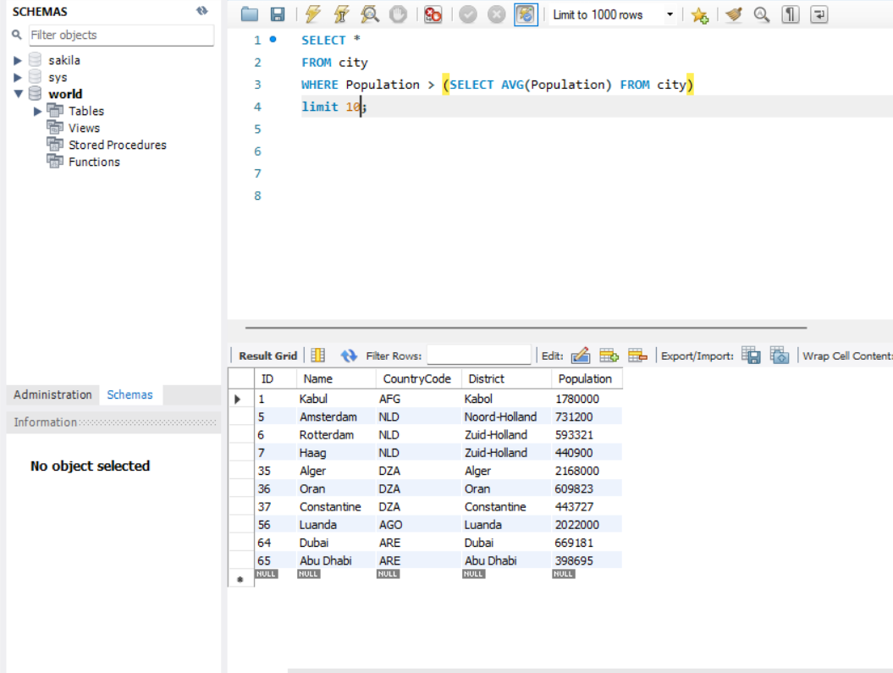
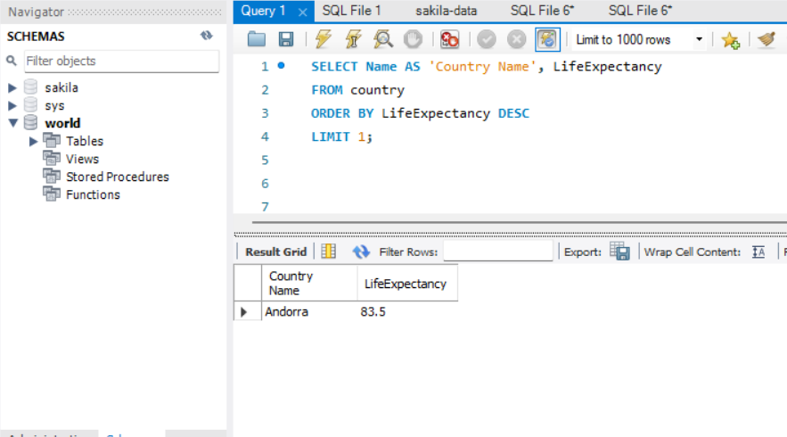
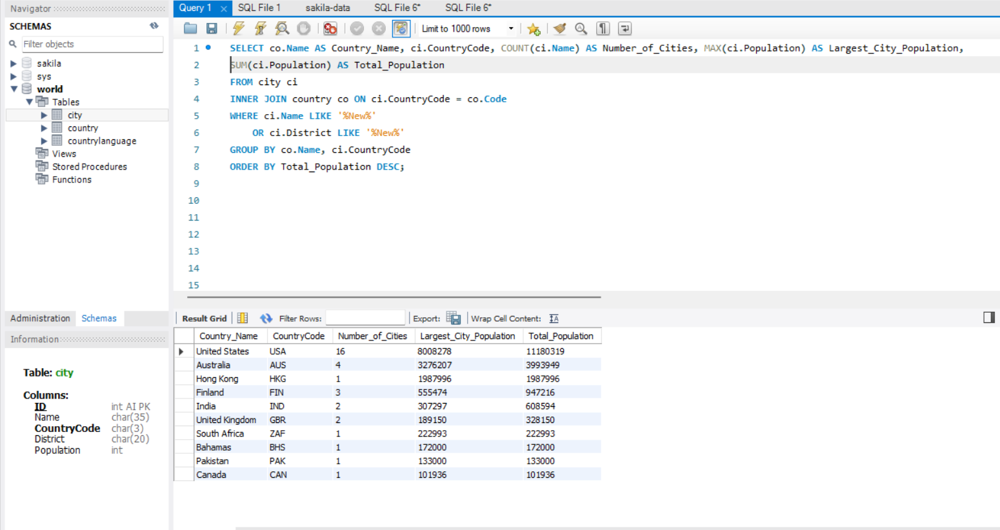
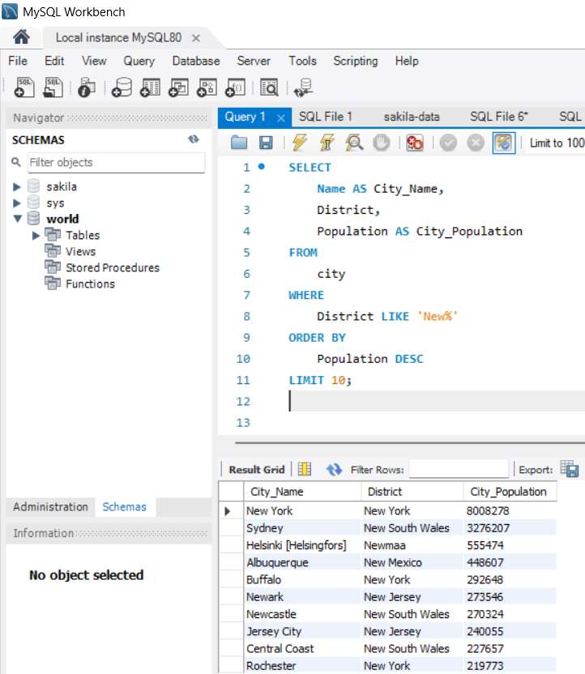
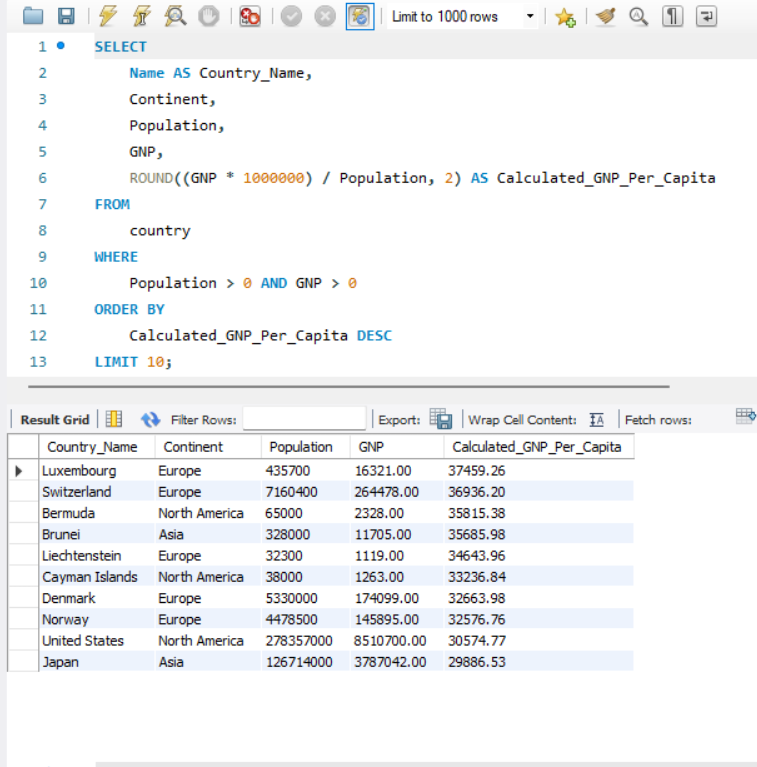

# World (MySQL)

## 🔹 Project Overview

This project uses **MySQL** to analyse the **World** relational database and explore global population, geographical, and economic trends.

The analysis focused on:

- Population comparisons between countries and cities
- Demographic trends such as population distribution and life expectancy
- Economic analysis including GDP per capita comparisons
- Identifying patterns within country and city data

---

## 🔹 Dataset

**World Database**

- **Source:** Provided via bootcamp
- **Database Tables:**
  - Country
  - City
  - CountryLanguage

The database contains global information stored across three related tables, allowing the analysis of countries, cities, languages, populations, and economic indicators.

---

## 🔹 Data Preparation

The following steps were completed during the analysis:

| Process | Description |
|---------|-------------|
| Database Exploration | Reviewed the database schema and relationships between tables |
| Data Understanding | Examined tables, columns, data types, and available information |
| Query Development | Wrote SQL queries to answer business questions |
| Data Analysis | Applied filtering, grouping, aggregation, and sorting techniques |
| Results Review | Analysed query outputs to identify trends and patterns |

---

## 🔹 Analysis

The analysis involved:

- Filtering records using `WHERE`
- Aggregating data using `COUNT()`, `AVG()`, `MAX()`, and other aggregate functions
- Grouping results using `GROUP BY`
- Sorting data using `ORDER BY`
- Working with relational tables to analyse connected data
- Comparing countries, cities, and economic indicators

  
   
  <em>Population is greater than average population of all cities</em>

I used the WHERE clause to return all the cities that have a population that is bigger than the combined average population.

  
   
  <em>Country with highest life expectancy</em>

I used the ORDER BY clause in this query to return the country with the highest life expectancy, 

  
   
  <em>Countries with hightest population of new cities or districts</em>

In this query I used an INNER JOIN, WHERE, COUNT(), MAX(), SUM(), GROUP BY, and ORDER BY to analyse the population of cities and districts containing "New" in their name.

---

## 🔹 Key Findings

### 1. Population Analysis

I analysed city populations to identify the largest population centres within the database.

The results showed that:

- **New York City** had the largest population, with over **8 million** residents.
- **New South Wales** followed with approximately **3 million** residents.
- **Newmaa** had a population of over **500,000** residents.
  

  
   
  <em> New Districts with the highest population.</em>

**Business relevance:**

This can help organisations identify major population centres, helping them to target densely populated markets for marketing, logistics, and business expansion.

---

### 2. Economic Analysis

I compared countries using **Gross National Product (GNP)**

The analysis showed that countries such as **Luxembourg** and **Switzerland** have a higher GNP per capita than much larger economies, such as the **United States** and **Japan**.

  
   
  <em> Countries with the highest GNP.</em>

**Business relevance:**

Comparing economic performance helps organisations identify high-value markets, understand purchasing power, and support investment or expansion decisions.

---

## ✅ Conclusion

This project demonstrates my ability to use **MySQL** to query relational databases, analyse population and economic data, apply SQL functions, and extract meaningful insights through filtering, aggregation and grouping techniques.
