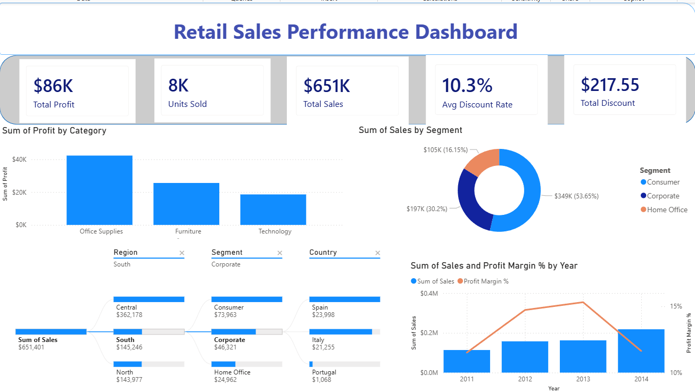

# 📊 Spotify Features Dashboard (Tableau)

[View The Dashboard](https://public.tableau.com/app/profile/radwa.mousa/viz/SpotifyFeatures_17803954528880/SpotifyFeatures)

## 🔹 Project Overview

This project uses **Tableau** to analyse Spotify track data and analyse trends in music popularity.

The interactive dashboard allows users and stakeholders to explore the relationships between audio features and popularity, providing insights into factors that contribute to a tracks success.

---

## 🔹 Dataset

**Spotify Features Dataset**

- **Source:** Provided via bootcamp

The dataset contains **232,726 rows** of retail transaction data, including information about sales, products, customers, locations, and customer segments.

The data was stored across two tables, which were connected using **Order ID** as the common field.

---

## 🔹 Data Preparation

The following steps were completed during the project:

| Process | Description |
|---------|-------------|
| Data Importing | Importing and exploring the Spotify dataset. |
| Data Calculation | Applying aggregation functions such as SUM() and AVG(). |
| Worksheet Creation | Creating multiple worksheets to analyse different listener trends. |
| Data Exploration | Adding linear regression trend lines to identify correlations between variables. |
| Dashboard Design | Building an interactive dashboard using filters and multiple visualisations. |
| Trend Identification | Analysing the completed dashboard to identify key insights. |

---

## 🔹 Data Formatting and Transformation

- **Methods & Tools Used** 

Here I used data aggregation using average and sum calculations, scatter plots with linear regression trend lines, bar charts compare genres and artists, interactive filters to explore different areas of the dataset, and interactive dashboard design using multiple worksheets. 

---

## 🔹 Analysis

The dashboard was created to explore:

- Overall sales and profit results
- How sales are distributed across customer segments
- How different regions contribute to total sales
- The factors that influence overall sales performance

  
   
  <em>Spotify Features Dashboard created in Tableau.</em>

The dashboard allows users to interact with different visuals, by selecting a category, region, or segment the charts show relevant sales information. This helps users explore the data in more detail.

---

## 🔹 Key Findings

### 1. Track Characteristics and Popularity

The analysis found a positive relationship between danceability and popularity, with tracks scoring between 0.5 and 0.7 in danceability having higher popularity. It also showed that tracks lasting between 3.5 – 4.5 minutes performed better than shorter or longer songs.

**Business relevance:**

These insights could help Spotify improve playlist recommendations and support artists and record labels in understanding listener preferences.

---

### 2. Genre and Artist Performance

The dashboard showed that Pop, Rap, and Rock were the most popular genres in the dataset. Drake achieved the highest overall popularity, while artists such as Hans Zimmer showed that other genres can also generate significant listener engagement.

**Business relevance:**

Understanding genre and artist performance can be used to support playlist curation, marketing and increase user engagement.

---

## ✅ Conclusion

This project demonstrates my ability to analyse large datasets, create visualisations tailored to specific data goals and draw insights and trends.
