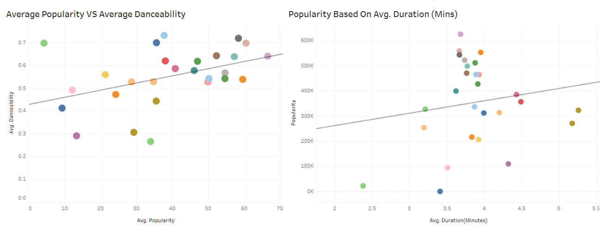
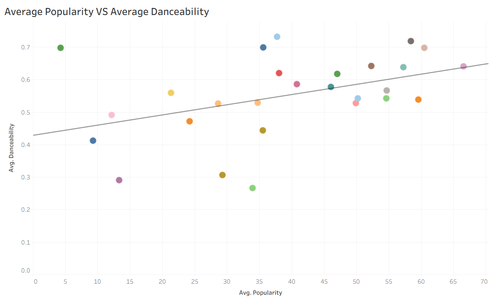

# 📊 Spotify Features Dashboard (Tableau)

[View The Dashboard](https://public.tableau.com/app/profile/radwa.mousa/viz/SpotifyFeatures_17803954528880/SpotifyFeatures)

## 🔹 Project Overview

This project uses **Tableau** to analyse Spotify track data and analyse trends in music popularity.

The interactive dashboard allows users and stakeholders to explore the relationships between audio features and popularity, providing insights into factors that contribute to a tracks success.

---

## 🔹 Dataset

**Spotify Features Dataset**

- **Source:** Provided via bootcamp

The dataset contains **232,726 rows** of retail transaction data, including information about sales, products, customers, locations, and customer segments.

The data was stored across two tables, which were connected using **Order ID** as the common field.

---

## 🔹 Data Preparation

The following steps were completed during the project:

| Process | Description |
|---------|-------------|
| Data Importing | Importing and exploring the Spotify dataset. |
| Data Calculation | Applying aggregation functions such as SUM() and AVG(). |
| Worksheet Creation | Creating multiple worksheets to analyse different listener trends. |
| Data Exploration | Adding linear regression trend lines to identify correlations between variables. |
| Dashboard Design | Building an interactive dashboard using filters and multiple visualisations. |
| Trend Identification | Analysing the completed dashboard to identify key insights. |

---

## 🔹 Data Formatting and Transformation

  

- Here I used **aggregations** such as average and sum calculations to accurately measure track features and engagement to draw insights.

  

- Here I used a **scatter plot** with a linear regression line to identify patterns and see whether the tracks duration affected its popularity.  

---

## 🔹 Analysis

The dashboard was created to explore:

- Overall popularity of different music genres.
- Individual artist's popularity based on total popularity points
- Compared average audio features and total popularity across genres to identify possible relationship.
- How average danceability levels correlate with track success
- The relationship between track duration and popularity

  

  

The dashboard allows users to interact with different visuals. By selecting a genre or artist, the charts show relevant track information. This helps users explore the data in more detail.

---

## 🔹 Key Findings

### 1. Track Characteristics and Popularity

The scatter plot with a trendline was used to show how tracks with higher danceability scores generally achieve higher average popularity.

  

The analysis showed that:
- A **positive** relationship between danceability and popularity.
- Tracks scoring between **0.5 and 0.7** in danceability having higher popularity.
- Tracks lasting between **3.5 – 4.5** minutes performed better than shorter or longer songs
  
**Business relevance:**

These insights could help Spotify improve playlist recommendations and support artists and record labels in understanding listener preferences.

---

### 2. Genre and Artist Performance

A bar chart was used to compare Artist's popularity based on their total popularity scores. 

  

The analysis showed that:
- **Pop**, **Rap**, and **Rock** were the most popular genres.
- **Drake** achieved the highest overall popularity.
- Artists such as **Hans Zimmer** showed that other genres can also generate significant listener engagement.

**Business relevance:**

Understanding genre and artist performance can be used to support playlist curation, marketing and increase user engagement.

---

## ✅ Conclusion

This project demonstrates my ability to use **Tableau** to analyse large datasets, create visualisations tailored to specific data goals and draw insights and trends.
