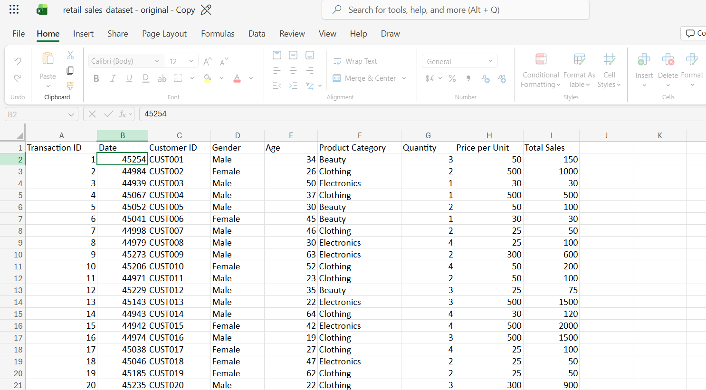
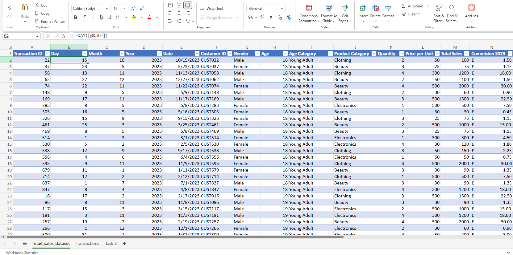
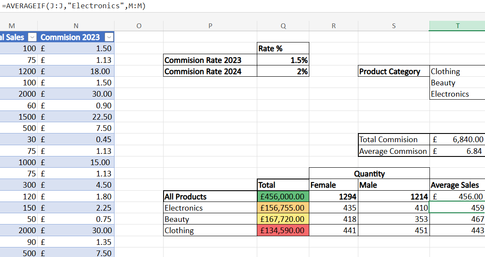
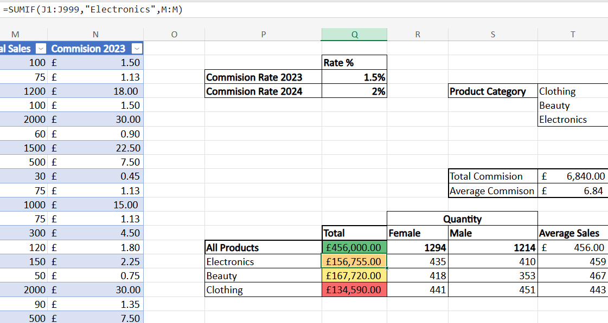
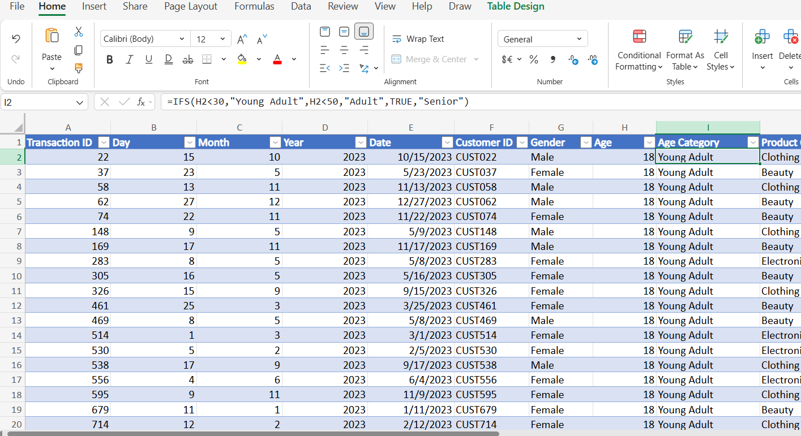
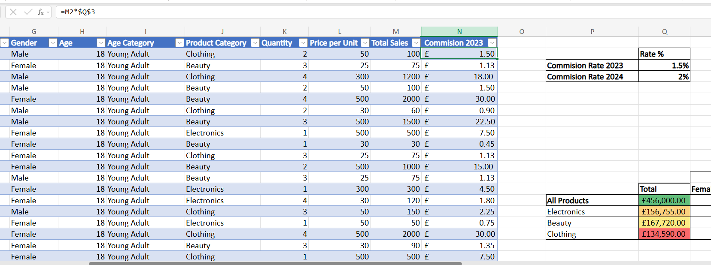

# 📊 Excel Sales Data Analysis Project

---

## 🔹 Project Overview

Throughout these two projects, I used **Microsoft Excel** to clean, analyse, and visualise retail and bike sales data.

The aim was to transform sales data into insights by analysing **customer behaviour, product performance, and revenue trends**.

---

## 🔹 Datasets

### Retail Sales Dataset

### Bike Sales Dataset

**Source:** Provided via bootcamp

The retail dataset contains **1,001 rows** of customer, product, and sales information.

The bike sales dataset contains **113,037 transactions**, including customer demographics, product information, sales, costs, and revenue.

---

# 🔹 Data Preparation

The following data preparation steps were completed:

| Process | Description |
|---|---|
| Data Cleaning | Removing duplicates and organising datasets |
| Data Formatting | Standardising dates and currency formats |
| Data Calculations | Applying Excel formulas to calculate business metrics |
| Data Analysis | Creating PivotTables to summarise sales performance |
| Visualisation | Building PivotCharts to identify trends |
| Quality Checks | Using conditional formatting to highlight key patterns |

# 🔹 Data Formatting and Transformation

The original Date column displayed Excel serial numbers instead of a date, so I changed the format of the Date column to **“Date”** to allow the dates values to be displayed correctly.

I also used the **YEAR()**, **MONTH()**, and **DAY()** functions to extract the year, month, and day from the original Date column.

Creating separate date fields made it easier to analyse sales trends over time using PivotTables and PivotCharts.

  
    
  <em> This is the raw dataset.</em>

                                                              

  

- Here I used the DAY () function, to return the day of the month.   

                

  

- I changed the column format to Date so the values display correctly.                                                      
                                                          
---

# 🔹 Analysis

The analysis involved:

- **Data cleaning and formatting**
- **SUMIFS and AVERAGEIF functions**
- **Calculated columns for revenue, cost, and profit**
- **PivotTables to summarise data**
- **PivotCharts to visualise and analyse trends**
- **Conditional formatting to highlight performance**

---

# 🟦 Retail Dataset Analysis

## Product Performance Analysis

I created a product performance summary table to analyse sales performance and customer purchasing behaviour.

The table included **total sales, customer purchases by gender, and average sales per product**.

  

  

I used **SUMIF()**, **SUMIFS()**, and **AVERAGEIF()** to calculate sales metrics based on different criteria and applied conditional formatting to highlight higher and lower performing products.

This helped identify differences in product performance and purchasing patterns.

---

## Creating Age Categories

The original dataset had a numerical age column, I created an age category column using the **IFS()** function to group customers into Young Adults, Adults, and Seniors.

  

This made it easier to compare sales across different age groups in PivotTables and charts.

---

## Creating Calculated Columns

The original dataset did not contain a commission value, so I created a new Commission column to calculate the commission earned on each sale.

I calculated this by multiplying the Total Sales value by the commission rate of **1.5%**.

  

---

# 🟦 Bike Sales Dataset Analysis

## Revenue and Profit Trend Analysis

I created a PivotTable and chart to compare revenue by age group. 

  

The chart shows that Adults (35-64) make up the largest customer segment and they are responsible for half of the overall revenue. The senior age group make up less than 1% of total revenue. 

---

# 🔹 Key Findings

## 1. Customer Purchasing Behaviour

The retail analysis showed that clothing was the most frequently purchased product category by both male and female customers.

However, despite having the highest purchase volume, clothing generated the lowest total sales, indicating a lower average selling price compared with other product categories.

  
   
  <em> Quantity Table.</em>

> **Business relevance:**  
> Understanding purchasing behaviour helps organisations evaluate pricing strategies, product performance, and opportunities to improve profitability.

---

## 2. Revenue Trends and Market Performance

The bike sales analysis revealed strong revenue growth over five years, reaching a peak of **$29.7 million in 2021**.
The **United States** generated the highest overall revenue at **$30 million** and **Canada** has the lowest overall revenue at **$8 million** 

The United States generated the highest overall revenue.

  
   
  <em> Revenue over the next five years.</em>

  
   
  <em> Product Revenue by Country.</em>

The analysis showed that:

- The bike sales analysis revealed strong revenue growth over five years, reaching a peak of **$29.7 million in 2021**.
- The **United States** generated the highest overall revenue at **$30 million**
-  **Canada** has the lowest overall revenue at **$8 million** 

 **Business relevance:**  
These insights can help organisations identify high-performing markets, understand their core customer base, and make informed decisions about future sales and marketing strategies.

---

# ✅ Conclusion

This project demonstrates my ability to clean and analyse data using **Excel**, apply formulas and PivotTables, create visualisations, and identify meaningful business insights.
